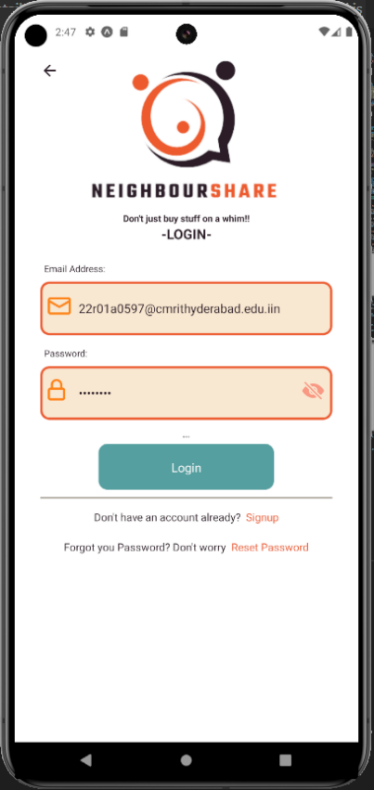
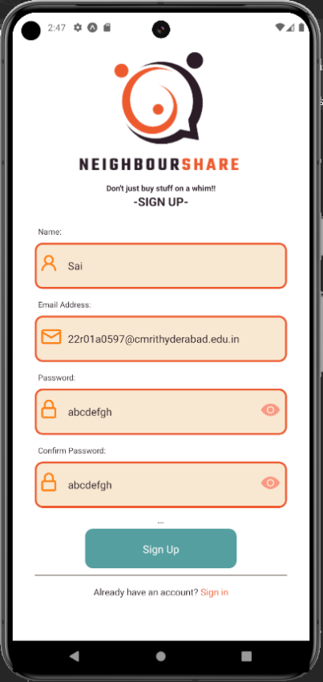
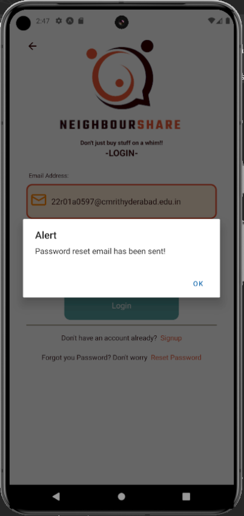
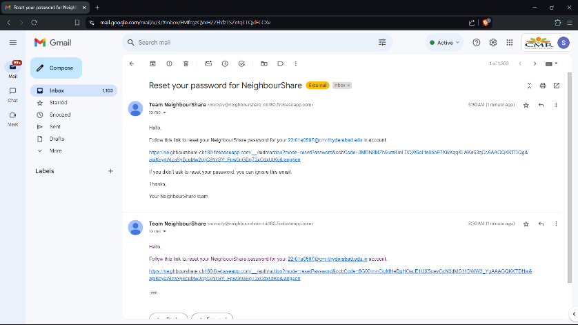
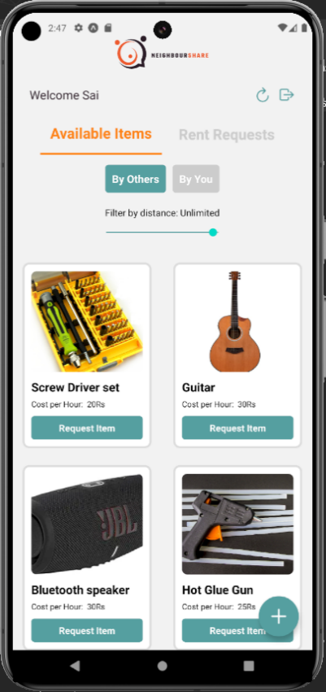
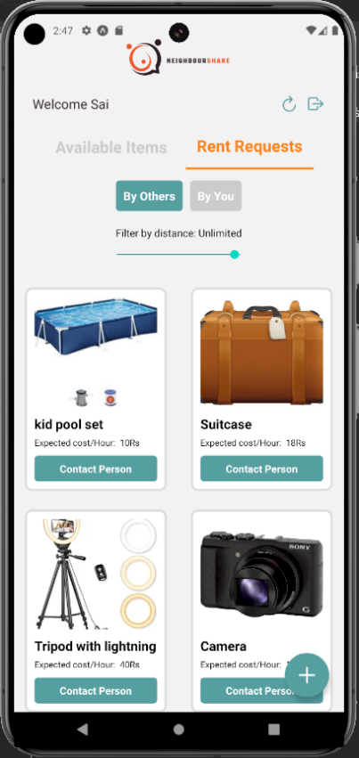
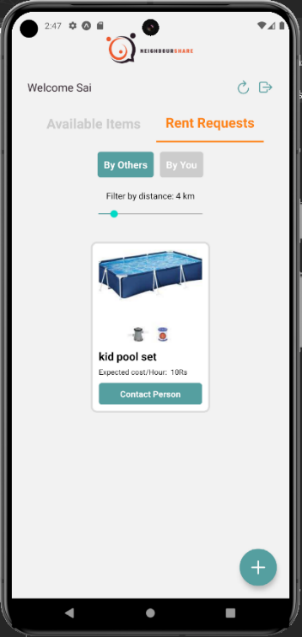
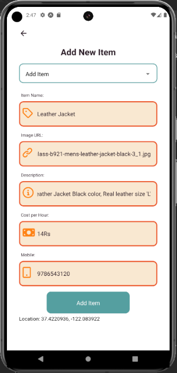
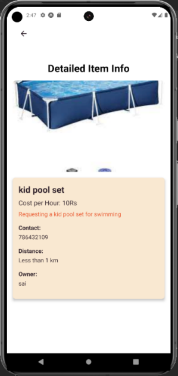

# NeighbourShare

NeighbourShare is a location-based peer-to-peer mobile app built using **React Native** and **Firebase** that enables users to **lend**, **borrow**, or **request** items within their local communities.

---
## 📱 Screenshots

<table>
  <tr>
    <td></td>
    <td></td>
  </tr>
  <tr>
    <td></td>
    <td></td>
  </tr>
</table>

### 📧 Email Verification

<p align="center">
  
</p>

<table>
  <tr>
    <td></td>
    <td></td>
  </tr>
  <tr>
    <td></td>
    <td></td>
  </tr>
  <tr>
    <td></td>
    <td></td>
  </tr>
</table>
---

## 🧠 Features

- 🔐 **Secure Authentication** using Firebase (Email + Gmail sign-in with verification).
- 📍 **Location-Based Filtering** of items using a range slider.
- 🗂️ **Item Management**:
  - Add your own items for rent.
  - Post rent requests for needed items.
  - View and delete your own listings.
- 🧾 **Real-time Database** with Cloud Firestore.
- ☎️ **Direct Communication** via owner contact details.
- 🔁 **Dynamic User Interface** with toggle views between Available Items and Rent Requests.

---

## 🏗️ Tech Stack

| Layer       | Tech                     |
|-------------|--------------------------|
| Frontend    | React Native + Expo      |
| Backend     | Firebase Authentication + Firestore |
| State/Storage | React State, Firestore |
| Location    | Expo Location API        |
| Styling     | React Native Stylesheets |
| Emulation   | Android Studio AVD / Expo Go |

---

## ⚙️ Installation

1. Clone the repo:
   ```bash
   git clone https://github.com/your-username/neighbourShare.git
   cd neighbourShare
   ```

2. Install dependencies:
   ```bash
   npm install
   ```

3. Install Expo CLI if not already installed:
   ```bash
   npm install -g expo-cli
   ```

4. Start the app:
   ```bash
   expo start
   ```

---

## 📦 Firebase Configuration

Make sure to configure `firebaseConfig.js` with your Firebase credentials:

```js
// firebaseConfig.js
import firebase from 'firebase/app';
import 'firebase/auth';
import 'firebase/firestore';

const firebaseConfig = {
  apiKey: "YOUR-KEY",
  authDomain: "YOUR-AUTH-DOMAIN",
  projectId: "YOUR-ID",
  storageBucket: "YOUR-BUCKET",
  messagingSenderId: "YOUR-ID",
  appId: "YOUR-APP-ID"
};

if (!firebase.apps.length) {
  firebase.initializeApp(firebaseConfig);
}

export { firebase };
```

---

## 🔍 Modules Overview

### 🔑 Authentication
- Register, Login, Email Verification
- Forgot Password Recovery

### 📦 Item Module
- Add Item / Rent Request
- View Items by Distance
- Delete own listings

### 📍 Location Module
- Location access and filtering
- Distance calculation using Haversine formula

### 📬 Communication
- Contact owners via displayed phone number

---

## 📐 Architecture

- **Frontend:** Component-based architecture using React Navigation
- **Backend:** Serverless (Firestore, Firebase Auth)
- **Data Flow:** Firestore provides real-time updates with listeners.

---

## 🧪 Development Requirements

| Type        | Specification             |
|-------------|---------------------------|
| OS          | Android 8 / iOS 12+       |
| IDE         | VS Code                   |
| Emulator    | Android Studio AVD        |
| Language    | JavaScript (ES6+)         |
| Frameworks  | React Native, Expo        |
| Database    | Firebase Firestore        |

---

## 🤝 Contributing

Feel free to fork and submit pull requests. Ensure you:
- Follow the existing code style.
- Write clear commit messages.
- Test your changes.

---

## 📃 License

This project is licensed under the [MIT License](LICENSE).

---

## 🌍 Vision

NeighbourShare aims to:
- Reduce resource waste.
- Promote cost-efficient sharing.
- Strengthen local community interaction.

---

> “Don’t just buy stuff on a whim – borrow it from your neighbor.”
